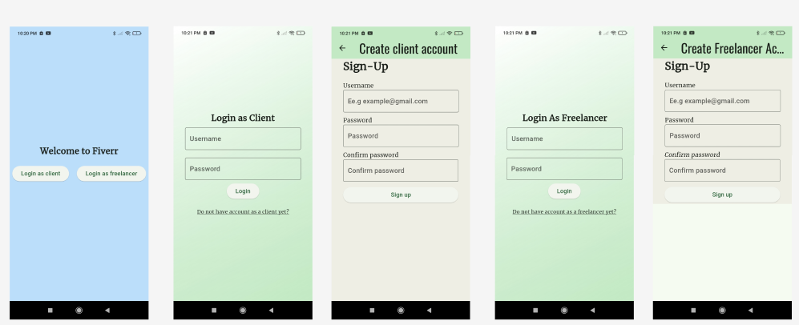
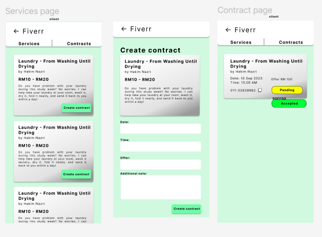
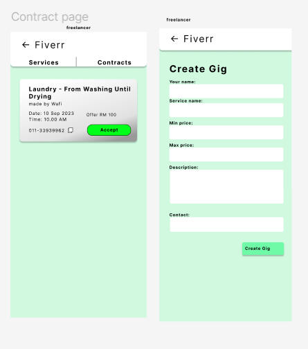
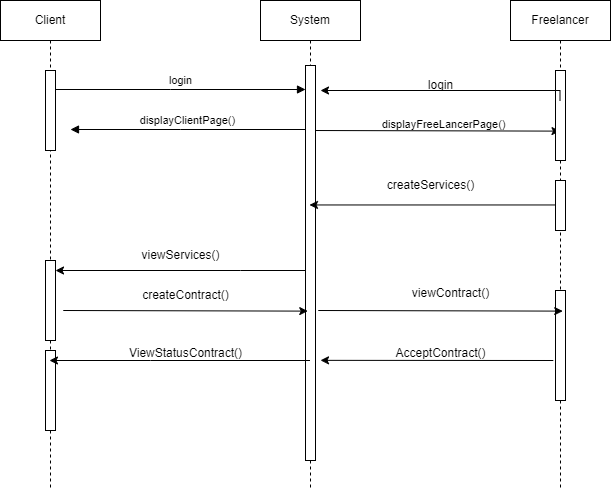

***Group Sadge IIUM***
1. ABDULLAH ALWAFI BIN MOHD AMINUDIN 2219713
2. MUHAMMAD HAKIM BIN MD NAZRI 2110457
3. MUHAMMAD HARITH IRFAN BIN MUHAMAD SUHAILI 2211867

# Work distribution
|Hakim |Wafi  | Harith|
|---|---|---|
|Authentication subsystem|Contract subsystem|Gig subsystem|
|Setup Firebase|Client view and add contract|freelancer view and add gig|

# Instruction
1. Git clone
`git clone https://github.com/hakimnazry24/Fiverr-Clone-.git`
2. Download dependancy
`flutter pub get`
3. Run Flutter app
`flutter run`

# Fiver App
The Fiverr app is a widely-used platform that connects freelancers with clients seeking various services, from graphic design and digital marketing to writing and programming. The platform has revolutionized the gig economy by providing a streamlined and user-friendly interface for both service providers and clients. Our project aims to replicate the core functionalities of the Fiverr app, creating a robust and scalable platform that facilitates seamless interactions between freelancers and clients.

**Objective:**
1. User-Friendly Interface: Develop an intuitive and responsive user interface that caters to both service providers (users) and clients, ensuring a seamless user experience.

2. Service Offerings: Implement a robust system for users to offer their services, allowing them to post detailed descriptions, pricing, and delivery times.

3. Contract Proposals: Allow clients to offer contracts for specific services, detailing their requirements, budgets, and deadlines.

4. Authorization and Authentication: Implement secure authorization and authentication mechanisms to ensure that both clients and users can safely access and manage their accounts.

5. Contract Acceptance: Develop a feature for users to review and accept contract proposals from clients, facilitating clear agreements and expectations.

6. Scalability and Performance: Ensure the platform is built with scalability in mind, capable of handling a growing user base and high transaction volumes without compromising performance.

**Main Goal:**
The main goal of this project is to create a comprehensive and user-centric platform that replicates the core functionalities of the Fiverr app, with a focus on enabling users to offer services and clients to propose contracts. By incorporating secure authorization for both clients and users, along with essential features such as service listings and contract management we aim to provide a reliable and efficient marketplace for freelancers and clients to connect, collaborate, and conduct business.

## Features and Functionalities
1. **Create Gig Features** : In the freelancer page, the user can create their services or gig; they can state what service they do, details of their job, price rate for their service, and their own details. They also can edit, delete the gig created.
2. **Create Contract** : In the client page, based on the services list by the freelancer, they can create a contract based on the services. The client can add their details, details of their job or task, offer for the job, and due date and time for the specific job.
3. **View Contract** : On the client page, after they have created a contract, they can know the status of the contract, whether it is accepted by the freelancer, pending, or declined by the freelancer.
4. **Accept Contract** : In the freelancer page, user can view the contract and choose to accept or decline the contract
5. **Login & Authentication** : This feature can determine who is the user, whether it is a client or freelancer; it will direct to a specific page for the client and freelancer.
6. **Firebase Integrated** : This app is integrate with firebase firestorage to manage the database.
 
## Screen Navigation and Widgets
**Screen Navigation**
1. Client: Login page -> Services Available -> Create Contract -> View Contract
2. Freelancer: Login page -> Create Services page -> View Contract page -> Accept Contract

**Widget Use**

**Authentication**

Login Page

1. User can login as client or freelancer.
2. If user dont have account , they can created account, only need password and login
3. Once created, user can go to client page or freelancer page depends on what they register.

***Client***

Client Page

1. Services Available page: Contain widget like container and sizedbox that display the data of the services create by freelancer. It also has create contract button that will navigate page to create contract page.
2. Create Contract page: Contain widget container that display details of the services. Then it has form widget that has validator for each input. The input are client name, client phone no, due date, time, offer, and additional notes. The due date and time input use plugin date and time picker install in flutter. It also has button that will create contract once it has validate. The data will be push to firebase firestorage.
3. View Contract Page: This is the page where client can view their contract they have make and can know the status of the contract. It contain widget like container and sizebox to display the detail of the contract with service along with the status, then it also contain icon copy button for freelancer to copy the freelancer phone no to contact them.

***Freelancer***

Freelancer Page

1. Create Services Page: Contain widget like form widget that can get input from the user to create services. Has validator with controller input that can get the input and pass it to firebase storage once button is press and form is validate. Also contains button widget that can update and delete services.
2. Accept Offer Page: Contain similar widget like view contract page in client page, but has additional widget like button to accept or decline the contract offer. The widget is connected to firebase firestorage like the widget that display status.

## Sequence Diagram

This is sequence Diagram for this app.

## Schedule

## References

1. Flutter Official Documentation. Retrieved on 26 June 2024 from https://flutter.dev/docs
2. Firebase Official Documentation. Retrieved on 26 June 2024 from https://firebase.google.com/docs/firestore/quickstart
3. Pinkesh, D. (2020). A Deep Dive Into DatePicker In Flutter. Retrieved on 26 June 2024 from https://medium.com/flutter-community/a-deep-dive-into-datepicker-in-flutter-37e84f7d8d6c
4. Fiver Website. Retrieved on 26 June 2024 from https://www.fiverr.com/
5. Nicholas, C. & Bradley, K. (2024). How to Push an Existing Project to GitHub. Retrieve on 26 Jube 2024 https://www.digitalocean.com/community/tutorials/how-to-push-an-existing-project-to-github

